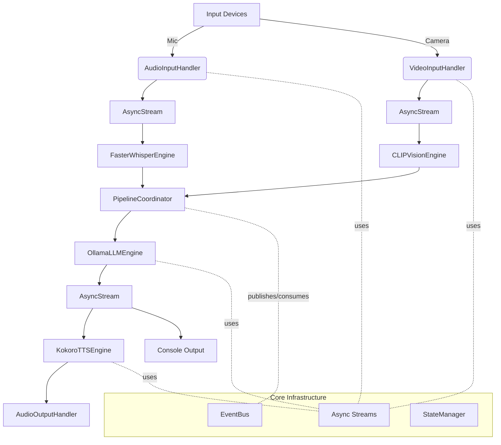
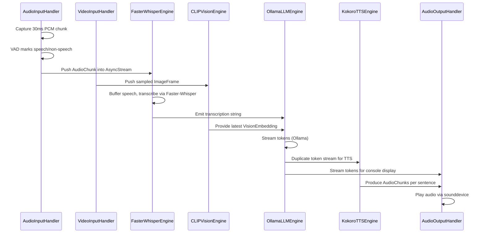

# Vera Multimodal Assistant Developer Guide

This guide explains how the Vera assistant is organized and how data moves through the system. It starts with a high-level view of the architecture and progressively drills down into the concrete Python implementation.

## Quick Start: Runtime Video Control

The assistant now supports toggling video input on/off at runtime:

- **Initial state**: Controlled by `enable_vision` in `Settings` (default: `False`)
- **Runtime toggle**: Press `v` + Enter to toggle video on/off
- **Programmatic control**: Call `await assistant.enable_video()` or `await assistant.disable_video()`

Example:
```python
from multimodal_assistant.config.settings import Settings
from multimodal_assistant.main import Vera

# Start with video disabled
settings = Settings(enable_vision=False)
assistant = Vera(settings)

# Enable video later
await assistant.enable_video()

# Toggle video
await assistant.toggle_video()
```

## Debug Mode & Performance Monitoring

### Enabling Debug Mode

Debug mode provides detailed logging and performance metrics:

```python
from multimodal_assistant.config.settings import Settings
from multimodal_assistant.main import Vera

# Enable debug mode
settings = Settings(
    debug_mode=True,      # Enables DEBUG logging + performance monitoring
    log_level="DEBUG"     # Alternative: "INFO", "WARNING", "ERROR"
)

assistant = Vera(settings)
```

### What Debug Mode Provides

When `debug_mode=True`:

1. **Detailed Logging**
   - Component initialization steps
   - Audio/video processing flow
   - STT transcription chunks
   - Vision encoding status
   - LLM token generation counts
   - TTS synthesis steps
   - Video toggle events
   - Keyboard commands
   - Error stack traces

2. **Performance Monitoring**
   - STT latency (transcription time)
   - Vision latency (encoding time)
   - LLM latency (token generation time)
   - TTS latency (synthesis time)
   - Performance summary on shutdown

### Log Levels

Configure logging verbosity:

```python
# DEBUG: All details (verbose)
Settings(debug_mode=True, log_level="DEBUG")

# INFO: Important events only (default)
Settings(debug_mode=False, log_level="INFO")

# WARNING: Warnings and errors only
Settings(log_level="WARNING")

# ERROR: Errors only
Settings(log_level="ERROR")
```

### Architecture Changes

**TextOutputHandler**: The `_display_text` method in `PipelineCoordinator` now uses `TextOutputHandler.display_stream()` instead of direct `print()` statements (`coordinator.py:212-213`).

**Performance Tracking**: All major pipeline components (`_process_audio`, `_process_vision`, `_generate_response`, `_synthesize_speech`) now track latency when a `PerformanceMonitor` is provided (`coordinator.py:100-235`).

**Logger Integration**: Each component has its own logger instance:
- `multimodal_assistant` (main)
- `multimodal_assistant.coordinator` (pipeline)
- `multimodal_assistant.engines` (engines)

## LLM Output Quality Improvements

### Clean Response Formatting

The LLM engine now includes:

1. **System Prompt**: Instructs the model to generate clean, natural responses without markdown, emojis, or special characters
2. **Output Filtering**: Removes standalone backslashes and excessive newlines from generated tokens
3. **Stop Sequences**: Prevents the model from continuing past a single response turn

### Customizing LLM Behavior

Configure the LLM's personality and output style through Settings:

```python
settings = Settings(
    system_prompt="You are Vera, a friendly assistant specializing in coding help.",
    temperature=0.7,  # Higher = more creative, Lower = more focused
    top_p=0.9         # Nucleus sampling threshold
)
```

**Default System Prompt**:
```
You are Vera, a helpful voice assistant.
Respond naturally and conversationally.
Keep responses concise and clear.
Do not use markdown formatting, emojis, or special characters.
Speak as if having a natural conversation.
```

### How It Works

1. **Prompt Engineering** (`llm_engine.py:53`): User input is wrapped with system prompt and conversation format
2. **Token Filtering** (`llm_engine.py:69-72`): Filters out problematic characters like standalone `\`
3. **Display Cleanup** (`output_handler.py:47-70`): TextOutputHandler removes any remaining formatting issues

This ensures clean, natural-sounding responses suitable for voice output.

## 1. System Architecture (High-Middle View)

At a glance Vera is an event-driven, streaming pipeline that ingests audio and video, runs them through specialized engines, and produces a coordinated text + speech response.



**Key Takeaways:**
- Input handlers turn device feeds into `AsyncStream` objects.
- Specialized engines implement well-defined interfaces (`engines/base.py`).
- `PipelineCoordinator` orchestrates cross-modal work, backed by the `EventBus`.
- Output handlers consume the same streaming abstractions for synchronized playback.

## 2. End-to-End Runtime Flow

The assistant processes audio and vision concurrently while streaming responses as soon as tokens are available.



Concurrency is achieved through asyncio tasks: audio transcription, vision encoding, and language generation run in parallel where possible. Backpressure is handled by bounded queues inside `AsyncStream` (`maxsize=10`).

## 3. Core Infrastructure

### 3.1 Event Bus (`core/event_bus.py`)
- Lightweight pub/sub with an internal `asyncio.Queue`.
- `PipelineCoordinator` publishes lifecycle events (`stt_started`, `llm_started`, etc.) for observability or future subscribers (analytics, UI overlays).
- Handlers can be sync or async; errors are caught and logged so one faulty consumer does not break the loop.

### 3.2 Streaming Primitives (`core/streams.py`)
- `AsyncStream[T]` exposes `put`, `next`, `map`, `filter`, and async iteration, providing a consistent streaming contract for every stage.
- Bounded queue enforces backpressure; helper transformations (`map`, `filter`) spin background tasks to produce derived streams.

### 3.3 State Management (`core/state_manager.py`)
- `StateManager` tracks sessions, conversation history, and the pipeline phase (`IDLE → LISTENING → PROCESSING → RESPONDING`).
- Uses an `asyncio.Lock` so UI layers or analytics can safely mutate/inspect state from multiple tasks.

## 4. Engine Layer

All engines satisfy abstract contracts in `engines/base.py`, ensuring interchangeable implementations.

| Engine | Interface | Key Responsibilities | Notable Optimizations |
|--------|-----------|----------------------|-----------------------|
| `FasterWhisperEngine` | `ISTTEngine` | Chunk buffered speech into utterances and stream `Transcription` objects. | CoreML-powered Faster-Whisper with INT8 quantization, 8 CPU threads, silence-based utterance boundaries. |
| `CLIPVisionEngine` | `IVisionEngine` | Encode sampled frames into embeddings for multimodal prompts. | Loads `CLIP` onto MPS when available; preprocesses in executor to avoid blocking event loop. |
| `OllamaLLMEngine` | `ILLMEngine` | Stream LLM tokens while merging optional vision context. | Uses `ollama.AsyncClient`, lazy model pull, minimal prompt wrapping for embeddings. |
| `KokoroTTSEngine` | `ITTSEngine` | Convert streamed text tokens into 24kHz audio chunks. | Sentence-aware buffering, falls back gracefully when Kokoro assets are absent. |

Each engine exposes `initialize()` and `shutdown()` for lifecycle management so `main.py` can preload models and release resources cleanly.

## 5. Pipeline Orchestration

### 5.1 Coordinator (`pipeline/coordinator.py`)
- Accepts audio and video streams, then launches dedicated asyncio tasks for transcription and vision encoding.
- After transcription completes, requests a streaming LLM response while still awaiting optional vision embeddings.
- Clones the LLM token stream into two `AsyncStream[str]` instances: one for console display (`_display_text`) and one for TTS synthesis (`_synthesize_speech`).
- Publishes events to the `EventBus` around key milestones for monitoring/telemetry.

### 5.2 Input Handlers (`pipeline/input_handler.py`)
- **AudioInputHandler**
  - Configures `sounddevice.InputStream` with 30ms mono frames at 16kHz.
  - Runs WebRTC VAD per chunk to tag `AudioChunk.is_speech` before enqueuing.
  - Uses `asyncio.run_coroutine_threadsafe` to bridge the audio callback thread into the main loop.
- **VideoInputHandler**
  - Captures frames via OpenCV, converts to RGB, wraps them as `ImageFrame`, and throttles via `asyncio.sleep(1/fps)`.
  - Designed to plug into additional processors such as `FrameSampler` for further downsampling.

### 5.3 Output Handlers (`pipeline/output_handler.py`)
- **AudioOutputHandler** plays synthesized speech by delegating to `sounddevice` in a thread pool so playback doesn’t block the event loop.
- `TextOutputHandler` (not yet wired in `main.py`) can present streamed tokens separately from stdout, enabling UI or logging sinks.

### 5.4 Processors (`processors/*.py`)
- `VADProcessor`: wraps WebRTC VAD, defaulting to “speech” if detection fails to keep the conversation flowing.
- `FrameSampler`: optional sampling decorator to enforce target FPS on arbitrary frame streams.
- `SentenceBuffer`: groups streamed tokens into sentence-level batches—currently leveraged inside `KokoroTTSEngine` logic.

## 6. Application Entry Point

`MultimodalAssistant` (`main.py`) wires everything together:
1. Instantiate the event bus, engines, input/output handlers, and the `PipelineCoordinator`.
2. Await `initialize()` on every engine in parallel.
3. Start audio/video capture, then continuously call `process_multimodal()` until interrupted.
4. On shutdown, stop device capture, drain playback, and dispose of every engine plus the event bus.

```mermaid
graph LR
    subgraph Startup
        A[Instantiate Components]
        A --> B[assistant.initialize()]
        B --> C[event_bus.start + engine.initialize]
    end
    subgraph Run Loop
        D[audio_input.start_capture]
        E[video_input.start_capture]
        D --> G[process_multimodal]
        E --> G
        G --> H[sleep 50ms]
        H --> G
    end
    subgraph Shutdown
        I[stop_capture]
        J[stop_playback]
        K[engine.shutdown]
        I --> L[event_bus.stop]
        J --> L
        K --> L
    end
```

## 7. Configuration & Utilities

- `config/settings.py` centralizes defaults for audio/video rates, model choices, and performance toggles (e.g., enabling MPS, selecting VAD aggressiveness).
- `utils/logger.py` offers structured logging; integrate it where richer observability is required.
- `utils/performance.py` keeps lightweight latency metrics by component, making it easy to print summaries after a run.

## 8. Extensibility Patterns

- **Swapping Models:** Implement the relevant interface in `engines/base.py`, register the new class in `main.py`, and adjust defaults in `config/settings.py`.
- **Adding Modalities:** Create a processor/engine pair that produces or consumes `AsyncStream` instances, then extend `PipelineCoordinator.process_multimodal()` to orchestrate it.
- **Event-Driven Integrations:** Subscribe to `EventBus` topics (e.g., `stt_started`) for UI overlays, metrics exporters, or debugging dashboards.
- **Testing Hooks:** `tests/` demonstrates unit coverage for streams, interfaces, and event bus behavior; new modules should follow the same pytest + asyncio pattern.

## 9. Development Workflow Reminders

- Use `./setup.sh` for first-time environment provisioning and model downloads.
- Run `./run.sh` (or `PYTHONPATH=src uv run python src/multimodal_assistant/main.py`) to launch the assistant.
- Execute `PYTHONPATH=src uv run pytest tests/ -v` before pushing changes; lint with `uv run ruff check` and format via `uv run black`.

---

The Vera assistant is deliberately structured around async streams and clean interfaces so new modalities, deployment environments, and monitoring hooks can be added without altering the core pipeline. Use this guide as the canonical map when extending or debugging the system.
